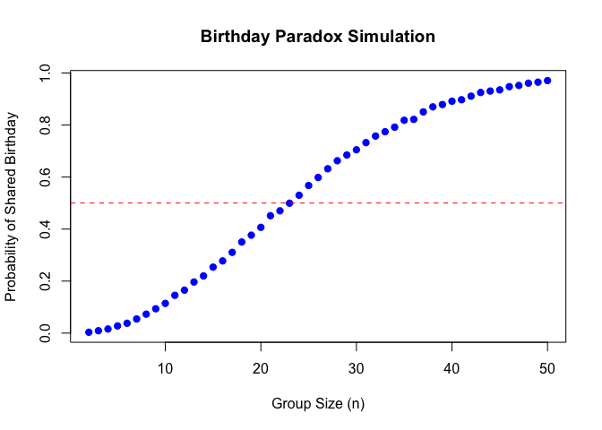
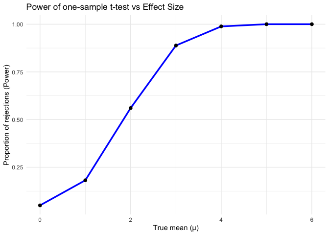
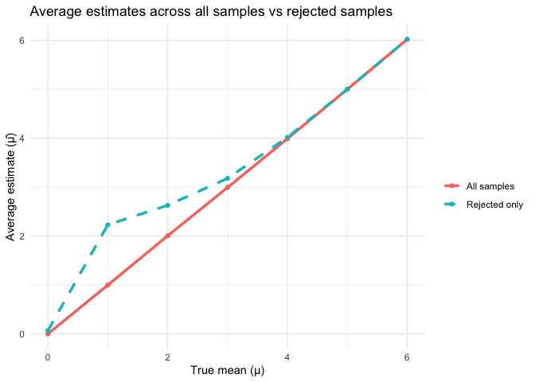

p8105_hw5_cz2955
================
2025-11-12

## Question1

### Function

``` r
same_birth<-function(n){
birthdays = sample(1:365, n, replace = TRUE)
  any(duplicated(birthdays))
}
```

### Simulation

``` r
set.seed(36501)  

n_values <- 2:50 
simulations <- 10000 
probabilities <- sapply(n_values, function(n) {
  mean(replicate(simulations, same_birth(n)))
})
```

### Plot

``` r
plot(n_values, probabilities, type = "b", pch = 19, col = "blue",
     xlab = "Group Size (n)",
     ylab = "Probability of Shared Birthday",
     main = "Birthday Paradox Simulation")

abline(h = 0.5, col = "red", lty = 2)
```

<!-- -->

## Question2

### Data

``` r
set.seed(36501)

n <- 30
sigma <- 5
mu_values <- 0:6
n_sim <- 5000
simulate_mu <- function(mu) {
  replicate(n_sim, {
    x <- rnorm(n, mean = mu, sd = sigma)
    test <- t.test(x, mu = 0)
    tibble(
      mu_true = mu,
      mu_hat = mean(x),
      p_value = test$p.value
    )
  }, simplify = FALSE) |> bind_rows()
}

results <- map_df(mu_values, simulate_mu)

results <- results %>%
  mutate(reject = p_value < 0.05)
results 
```

    ## # A tibble: 35,000 × 4
    ##    mu_true   mu_hat p_value reject
    ##      <int>    <dbl>   <dbl> <lgl> 
    ##  1       0  0.837    0.391  FALSE 
    ##  2       0  0.561    0.533  FALSE 
    ##  3       0 -0.0805   0.921  FALSE 
    ##  4       0 -0.908    0.215  FALSE 
    ##  5       0  0.103    0.904  FALSE 
    ##  6       0 -0.356    0.731  FALSE 
    ##  7       0  0.347    0.776  FALSE 
    ##  8       0 -0.450    0.677  FALSE 
    ##  9       0  0.00122  0.999  FALSE 
    ## 10       0  1.82     0.0409 TRUE  
    ## # ℹ 34,990 more rows

### Plot1

``` r
power_summary <- results %>%
  group_by(mu_true) %>%
  summarize(power = mean(reject))

ggplot(power_summary, aes(x = mu_true, y = power)) +
  geom_line(color = "blue", linewidth = 1.2) +
  geom_point(size = 2) +
  labs(
    x = "True mean (μ)",
    y = "Proportion of rejections (Power)",
    title = "Power of one-sample t-test vs Effect Size"
  ) +
  theme_minimal()
```

<!-- -->

### plot2

``` r
 mu_summary <- results %>%
  group_by(mu_true) %>%
  summarize(
    avg_mu_hat_all = mean(mu_hat),
    avg_mu_hat_reject = mean(mu_hat[reject])
  )

ggplot(mu_summary, aes(x = mu_true)) +
  geom_line(aes(y = avg_mu_hat_all, color = "All samples"), linewidth = 1.2) +
  geom_point(aes(y = avg_mu_hat_all, color = "All samples")) +
  geom_line(aes(y = avg_mu_hat_reject, color = "Rejected only"), linewidth = 1.2, linetype = "dashed") +
  geom_point(aes(y = avg_mu_hat_reject, color = "Rejected only")) +
  labs(
    x = "True mean (μ)",
    y = "Average estimate (μ̂)",
    title = "Average estimates across all samples vs rejected samples",
    color = ""
  ) +
  theme_minimal()
```

<!-- -->
Ans：No, the sample average of \$\$ across tests for which the null was
rejected is not approximately equal to the true value of $\mu$,
especially when the true effect size is small.

This happens because we are conditioning on rejection of the null
hypothesis (i.e.,𝑝\<0.05). When the true mean $\mu$ is close to 0, only
those samples that happened — by random chance — to produce unusually
large sample means will yield significant results. As a result, the
average of \$\$ among the “significant” samples is biased upward
relative to the true \$\$.

As the true effect size increases and the test’s power approaches 1,
this selection bias disappears — almost all samples are significant, and
the conditional average of \$\$ converges to the true value.

## Question3

### Baltimore Data

``` r
homicide_data <- read_csv("homicide_data.csv")
```

    ## Rows: 52179 Columns: 12
    ## ── Column specification ────────────────────────────────────────────────────────
    ## Delimiter: ","
    ## chr (9): uid, victim_last, victim_first, victim_race, victim_age, victim_sex...
    ## dbl (3): reported_date, lat, lon
    ## 
    ## ℹ Use `spec()` to retrieve the full column specification for this data.
    ## ℹ Specify the column types or set `show_col_types = FALSE` to quiet this message.

``` r
homicide_data <- homicide_data %>%
  mutate(city_state = str_c(state, city, sep = ", "))%>%
  mutate(
    unsolved = if_else(
      disposition %in% c("Closed without arrest", "Open/No arrest"),
      1, 0
    )
  )
head(homicide_data)
```

    ## # A tibble: 6 × 14
    ##   uid   reported_date victim_last victim_first victim_race victim_age victim_sex
    ##   <chr>         <dbl> <chr>       <chr>        <chr>       <chr>      <chr>     
    ## 1 Alb-…      20100504 GARCIA      JUAN         Hispanic    78         Male      
    ## 2 Alb-…      20100216 MONTOYA     CAMERON      Hispanic    17         Male      
    ## 3 Alb-…      20100601 SATTERFIELD VIVIANA      White       15         Female    
    ## 4 Alb-…      20100101 MENDIOLA    CARLOS       Hispanic    32         Male      
    ## 5 Alb-…      20100102 MULA        VIVIAN       White       72         Female    
    ## 6 Alb-…      20100126 BOOK        GERALDINE    White       91         Female    
    ## # ℹ 7 more variables: city <chr>, state <chr>, lat <dbl>, lon <dbl>,
    ## #   disposition <chr>, city_state <chr>, unsolved <dbl>

``` r
city_summary <- homicide_data %>%
  group_by(city_state) %>%
  summarize(
    total = n(),
    unsolved = sum(unsolved),
    .groups = "drop"
  )

baltimore <- city_summary %>%
  filter(city_state == "MD, Baltimore")

baltimore_test <- prop.test(
  x = baltimore$unsolved,
  n = baltimore$total
)

baltimore_result <- tidy(baltimore_test)
baltimore_result
```

    ## # A tibble: 1 × 8
    ##   estimate statistic  p.value parameter conf.low conf.high method    alternative
    ##      <dbl>     <dbl>    <dbl>     <int>    <dbl>     <dbl> <chr>     <chr>      
    ## 1    0.646      239. 6.46e-54         1    0.628     0.663 1-sample… two.sided

### Every City

``` r
city_results <- city_summary %>%
  mutate(
    test = map2(unsolved, total, ~ prop.test(.x, .y) %>% tidy())
  ) %>%
  unnest(test) %>%
  select(city_state, estimate, conf.low, conf.high, total) %>%
  arrange(desc(estimate))
```

    ## Warning: There was 1 warning in `mutate()`.
    ## ℹ In argument: `test = map2(unsolved, total, ~prop.test(.x, .y) %>% tidy())`.
    ## Caused by warning in `prop.test()`:
    ## ! Chi-squared approximation may be incorrect

``` r
city_results
```

    ## # A tibble: 51 × 5
    ##    city_state         estimate conf.low conf.high total
    ##    <chr>                 <dbl>    <dbl>     <dbl> <int>
    ##  1 IL, Chicago           0.736    0.724     0.747  5535
    ##  2 LA, New Orleans       0.649    0.623     0.673  1434
    ##  3 MD, Baltimore         0.646    0.628     0.663  2827
    ##  4 CA, San Bernardino    0.618    0.558     0.675   275
    ##  5 NY, Buffalo           0.612    0.569     0.654   521
    ##  6 FL, Miami             0.605    0.569     0.640   744
    ##  7 CA, Stockton          0.599    0.552     0.645   444
    ##  8 MI, Detroit           0.588    0.569     0.608  2519
    ##  9 AZ, Phoenix           0.551    0.518     0.584   914
    ## 10 CO, Denver            0.542    0.485     0.598   312
    ## # ℹ 41 more rows

### Plot

``` r
ggplot(city_results, aes(
  x = reorder(city_state, estimate),
  y = estimate
)) +
  geom_point(color = "darkorange", size = 2.2) +
  geom_errorbar(
    aes(ymin = conf.low, ymax = conf.high),
    width = 0.25,
    color = "gray40"
  ) +
  coord_flip() +
  labs(
    title = "Proportion of Unsolved Homicides by City",
    x = "City",
    y = "Estimated Proportion (95% CI)"
  ) +
  theme_minimal(base_size = 12) +         
  theme(axis.text.y = element_text(size = 8)) 
```

<!-- -->
